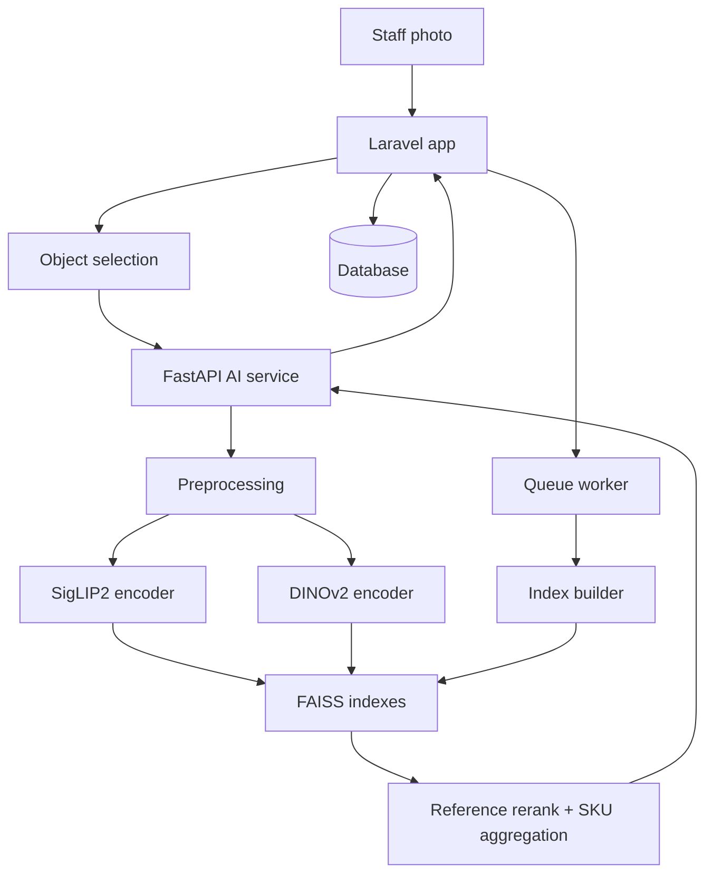

# Lensku — AI-Powered Visual SKU Search

Lensku (repository codename `barcode-finder`) is a visual SKU retrieval system for retail catalogs.
When a barcode or SKU label is missing, damaged, or hard to read, staff upload a photo and the
system returns the most visually similar SKU candidates from the catalog — with similarity scores,
not probabilities — for human confirmation.

It is **retrieval, not classification**: query images are encoded and matched against catalog
visual references using SigLIP2 + DINOv2 embeddings and FAISS vector search, then ranked at SKU level.

## Overview

```text
Store staff holds a physical product
↓
barcode / SKU missing or unreadable
↓
staff uploads a photo (optionally with object selection)
↓
Lensku searches catalog visual references
↓
Top-K SKU candidates with similarity scores
↓
staff confirms the correct SKU (feedback improves future retrieval)
```

This is harder than ordinary image matching: different SKUs can look nearly identical except for
size, length, color variant, shape, model, packaging, or small physical markings. The architecture
below (object-centric preprocessing, hybrid encoders, multi-reference SKU ranking, relevance and
ambiguity signaling) exists to handle exactly those cases — it does not claim perfect fine-grained
accuracy.

## Key Features

- **Visual product search** — upload a photo (`POST /search`) and get ranked SKU candidates.
- **Object selection** — automatic foreground/object proposals (`POST /select`, `POST /object-selection`),
  manual crop adjustment in the UI, or full-image search.
- **Hybrid retrieval** — SigLIP2 (semantic) + DINOv2 (appearance/detail) embeddings fused with
  configurable weights, shortlisted via FAISS HNSW (object + global indexes) and reranked.
- **Multi-reference SKU retrieval** — one SKU can own many reference photos; each is scored
  independently and the SKU score is the **best** reference score (no count bias).
- **Best-matching variant cover** — a result card shows the catalog photo that matched best
  (e.g. a yellow-variant query shows the yellow photo of the same SKU). Verified feedback images
  are never exposed as public covers.
- **Relevance & ambiguity signaling** — heuristic confidence levels, an optional frozen relevance
  policy gate, near-tie ambiguity flags, and a display similarity threshold.
- **Search feedback loop** — staff confirm the true SKU; eligible confirmations become retrieval
  references (reference memory, **not** model retraining).
- **Catalog management** — products, multi-photo SKUs, Excel import, object-selection review,
  attribute parsing, and role-based admin (`admin`, `super_admin`).
- **Production-safe index lifecycle** — incremental appends, authoritative full rebuilds, immutable
  FAISS generations with atomic publication, guarded concurrency, and retention pruning.

## How Visual Search Works

```text
Input image
  ↓  validation (type/size/pixel limits), EXIF orientation, RGB
Object selection (auto foreground proposal, manual crop, or full image)
  ↓  resize, square padding, global + local multi-crops
Visual encoding (SigLIP2 and DINOv2, normalized float32)
  ↓
FAISS candidate retrieval (per-model object/global shortlists, rank fusion,
  capped per SKU against count bias)
  ↓  rerank against stored reference vectors (+ optional patch/OCR/text signals)
SKU-level aggregation (max reference score wins; one card per SKU)
  ↓  confidence heuristic, ambiguity flag, optional calibrated threshold
Product results (similarity scores + best-matching catalog cover)
```



## AI & Retrieval Architecture

- **SigLIP2** (`google/siglip2-base-patch16-256`, 768-dim, default weight 0.35) — semantic/global
  visual encoder. Text tower is only used for optional description-text signals (disabled by default).
- **DINOv2** (`facebook/dinov2-small`, 384-dim, default weight 0.65, chosen for CPU) — appearance
  and fine-detail encoder. Optional patch-level rerank, tip-detail view, and proportion
  compatibility exist but are **disabled by default** (`*_WEIGHT=0.0`); enabling patch or tip
  features changes the index signature and requires a rebuild.
- **FAISS** (`faiss-cpu`) — HNSW indexes per model (`object` + `global` representations) over
  reference vectors stored in SQLite sidecars; FAISS ranks candidates, it does not classify.
- **SKU aggregation** — image-level hits are grouped per SKU; the SKU score is the strongest
  reference score, with deterministic tie-breaks. A SKU with 20 photos does not outrank a SKU
  with 2 photos on count alone (`CANDIDATES_PER_SKU=3` also caps shortlist slots per SKU).
- **Relevance handling** — without a frozen policy file the confidence level (`high`/`medium`/`low`,
  thresholds `HIGH_SCORE`/`HIGH_GAP`/`MEDIUM_SCORE`) is an uncalibrated heuristic; a validated
  frozen policy additionally gates below-threshold candidates. Laravel also hides rows below
  `AI_SEARCH_MIN_SIMILARITY` (default `0.72`) from display while keeping the true top-1 prediction
  for feedback. Near-ties within `AMBIGUITY_MARGIN` (default `0.05`) raise a display-only flag.

## Multi-Reference SKU Retrieval

```text
SKU FLOWER-001
├── 101.webp → purple variant
├── 102.webp → pink variant
└── 103.webp → yellow variant
```

- References are searched and scored independently.
- One SKU produces **one** result card; the winning reference sets the SKU score.
- `matched_image_ids` (score-ordered) is kept as match evidence.
- The winning **catalog** reference becomes the card cover, so a yellow query shows the yellow
  photo of the same SKU — without duplicating the SKU into three cards.

## Visual Index Lifecycle

- **Incremental indexing** — new photos and eligible verified feedback are appended into one new
  generation per batch (limit 50, coalesced queue job, single-writer lock). Served references are
  never mutated in place.
- **Full rebuild** — required when served references change (edits, deletes, re-encodes) or the
  pipeline signature drifts. Driven by a monotonic dirty revision with snapshot-aware
  reconciliation and follow-up scheduling.
- **Immutable generations + atomic `CURRENT`** — every build publishes a verified new generation
  directory and flips the `CURRENT` pointer atomically; a failed build leaves serving untouched.
- **Index consistency** — incremental claim → reload → export → build → guarded reconciliation, so
  a stale worker cannot mark newer `pending` / `rebuild-required` / `failed` state as `indexed`;
  rebuild-required rows are invisible to incremental runs.
- **Retention** — superseded generations and stale build workspaces are pruned per configured
  keep/grace windows.

## Technology Stack

| Layer | Technology |
|---|---|
| Backend | PHP 8.3, Laravel 13 |
| Frontend | Blade, Tailwind CSS v4, Vite, vanilla JS |
| Database | SQLite default; PostgreSQL + pgvector supported for the legacy driver |
| AI API | FastAPI, Uvicorn, Pydantic |
| Semantic encoder | SigLIP2 (`google/siglip2-base-patch16-256`) |
| Appearance encoder | DINOv2 (`facebook/dinov2-small`) |
| Vector search | FAISS (`faiss-cpu` HNSW) + SQLite sidecars |
| ML libs | torch 2.14, torchvision 0.29, transformers 4.57.6, Pillow, NumPy, OpenCV headless |
| Queue / cache | Laravel database queue + cache (retention-aware locks) |
| Object storage | local / public disks locally; S3-compatible (R2/MinIO/B2) in production |
| Import | Laravel Excel (`.xlsx`/`.xls`/`.csv` catalog import) |

## Project Structure

```text
barcode-finder/
├── app/
│   ├── Http/Controllers/   # Product, ObjectSelection, SearchFeedback, Auth, AdminUser
│   ├── Jobs/               # IndexVisualReference, RebuildVisualIndex
│   ├── Models/             # Product, ProductPhoto, SearchFeedback, ...
│   ├── Services/           # RetrievalClient, VisualIndexBuilder/Lifecycle, exporters
│   └── Console/Commands/   # index/catalog/maintenance commands (see below)
├── resources/
│   ├── views/              # Blade UI (catalog, visual search, admin)
│   └── js/                 # object-selection UI, upload/search UX helpers
├── ai-service/
│   ├── app/
│   │   ├── encoders/       # SigLIP2 / DINOv2 (+ legacy CLIP bridge)
│   │   ├── preprocessing/  # decode, foreground selection, crops, variants
│   │   ├── search/         # FAISS indexes, ranking/aggregation, service
│   │   ├── features/       # attributes, OCR (optional)
│   │   └── scripts/        # build_index, evaluate, calibrate, benchmarks
│   └── tests/              # retrieval/index/contract unit tests (unittest)
├── database/migrations/
├── routes/                 # web.php (catalog, search, feedback, admin)
└── tests/                  # Feature + Unit (PHPUnit)
```

Key services: `RetrievalClient` (single-attempt AI calls + response-contract validation),
`VisualIndexBuilder` (incremental/full builds), `VisualIndexLifecycle` (dirty-revision
invalidation), `VisualReferenceExporter` (authoritative snapshots), `SearchEvidence`
(15-minute staged feedback tokens), `ProductImages` (master/catalog/thumbnail variants).

## Installation

Prerequisites: PHP 8.3 + Composer, Node.js + npm, Python 3.11–3.13 (64-bit), a database
(SQLite works for development; PostgreSQL optional). First AI startup downloads public model
weights from Hugging Face (several GB with dependencies, cache, and index) and then works offline.

```bash
git clone https://github.com/satriaranggaj/barcode-finder.git
cd barcode-finder
composer install
npm install
```

```bash
cp .env.example .env
php artisan key:generate
php artisan migrate --force
php artisan storage:link
npm run build
```

The repo also ships a `composer setup` script (`install` → key → migrate → `npm run build`)
and a `composer dev` script (server + queue listener + Vite via concurrently).

## AI Service

From `ai-service/` (see `ai-service/README.md` for the full guide):

```powershell
cd ai-service
python -m venv .venv
.\.venv\Scripts\Activate.ps1
python -m pip install -r requirements-dev.txt
python -m pip check
```

Start it (single worker; Laravel expects it at `AI_SERVICE_URL`, default `http://127.0.0.1:8001`):

```powershell
python -m uvicorn app.main:app --host 127.0.0.1 --port 8001 --workers 1
```

`DEVICE=auto` uses CUDA when available, otherwise CPU. Set `ENABLE_LEGACY_EMBED=false` only if
nothing uses the legacy `/embed` path anymore (the legacy pgvector driver still does).

## Building the Visual Index

Artisan commands (all verified via `php artisan list`):

| Command | Purpose |
|---|---|
| `search:check` | AI readiness check for the FAISS `/search` driver |
| `search:build-index [--include-verified]` | Authoritative full FAISS generation build |
| `products:export-visual` | Stream catalog masters + crop metadata to a private build dataset |
| `products:compress-images` | Re-encode catalog variants in bounded chunks (keeps originals) |
| `products:backfill-images` | Backfill automatic object selection for existing photos |
| `products:refresh-attributes` | Regenerate parser attributes (never touches manual rows) |
| `search:cleanup-index` | Inspect/prune old generations, stale builds, old workspaces |
| `search:prune-pending` | Remove expired unconfirmed query images (15 min) |
| `search:build-dataset` / `search:export-training` | Verified-sample dataset tooling; **never trains a model** |

Rule of thumb: new photos and eligible confirmations flow through queued incremental indexing
automatically; edits/deletes/re-encodes of already-served references schedule a full rebuild.
Direct Python equivalent: `python -m app.scripts.build_index --dataset .\dataset [--rebuild]`.

## Environment Variables

Selected keys from `.env.example` (no secrets — see that file for the full list):

| Variable | Purpose |
|---|---|
| `SKU_SEARCH_DRIVER` | `faiss` (primary) or `legacy` (pgvector fallback without ai-service) |
| `AI_SERVICE_URL` | FastAPI base URL (default `http://127.0.0.1:8001`) |
| `AI_SEARCH_MIN_SIMILARITY` | Display threshold (default `0.72`) |
| `SKU_SEARCH_CONNECT_TIMEOUT` / `SKU_SEARCH_READ_TIMEOUT` | Bounded single-attempt AI calls (no retry) |
| `SEARCH_FEEDBACK_ENABLED` | Enable staff SKU confirmation flow |
| `REFERENCE_MIN_*` / `REFERENCE_MAX_DHASH_DISTANCE` | Eligibility heuristics for feedback references |
| `PRODUCT_IMAGE_DISK` / `TRAINING_IMAGE_DISK` / `QUERY_IMAGE_DISK` | Storage placement per image class |
| `AI_PYTHON_BINARY` / `FAISS_INDEX_PATH` | Local tooling path overrides |
| `INDEX_GENERATIONS_KEEP` / `INDEX_GENERATION_GRACE_SECONDS` / `INDEX_BUILD_STALE_HOURS` / `INDEX_EXPORT_RETENTION_DAYS` | Retention windows |
| `DB_QUEUE_RETRY_AFTER` | Must exceed the full-rebuild job timeout (7200s) |
| AI-service (`ai-service/.env`) | Model ids/revisions, `SIGLIP_WEIGHT`/`DINO_WEIGHT`, `CANDIDATES`, `CANDIDATES_PER_SKU`, thresholds, optional patch/OCR/secondary weights (default off) |

## Running Locally

Run each process separately (or `composer dev` for server + queue + Vite):

```bash
php artisan serve
npm run dev
php artisan queue:work --tries=1
# ai-service: uvicorn app.main:app --host 127.0.0.1 --port 8001 --workers 1
```

Then: log in (users are created by admins; `admin` / `super_admin` roles), add products + photos
in `/admin`, check readiness with `php artisan search:check`, and search from the catalog page.
Excel catalog import and user management live under the `super_admin` admin section.

## API / Health Endpoints

FastAPI (`ai-service/app/main.py`):

| Endpoint | Purpose |
|---|---|
| `GET /health` | Readiness: index loaded, models, relevance gating |
| `POST /search` | Visual retrieval → ranked SKU candidates + match evidence |
| `POST /select` | Object-selection proposals for the UI |
| `POST /prepare` | Image variant preparation for catalog uploads |
| `POST /embed` | Legacy embedding bridge (kept for compatibility) |

Laravel (`routes/web.php`): `GET /` catalog, `POST /search`, `GET /products/{product}`,
`POST /search-feedback` (auth, throttled), `POST /object-selection` (throttled), login/logout,
and the `admin` group (products, photos, selection review, import, users).

## Testing

```bash
php artisan test            # full Laravel suite (Feature + Unit)
npm test                    # frontend (vitest)
```

```bash
cd ai-service
python -m unittest tests.test_retrieval
```

Regression coverage includes: multi-reference ranking and count-bias protection, variant-cover
resolution with verified-image privacy, incremental/full index lifecycle, concurrency races
(stale workers, same-timestamp mutations, blame ownership, delete-during-build), batch drain
continuation, AI response-contract validation, feedback workflows, and UI/backend integration.

## Production Architecture

```text
Clients → Laravel → MySQL/PostgreSQL
              ├→ Queue worker → FAISS generations (incremental / full rebuild)
              └→ FastAPI AI service → SigLIP2 + DINOv2 → FAISS index
```

Object storage (S3-compatible) holds catalog masters and private verified references; transient
query images stay on the app server and are pruned within minutes. Run the queue worker with a
reservation window longer than the full-rebuild timeout (see `DB_QUEUE_RETRY_AFTER`).

## Privacy / Reference Safety

- **Catalog `ProductPhoto`** assets are the only images ever shown publicly.
- **Verified `SearchFeedback`** images are private; eligible ones may join FAISS retrieval memory
  but must never become product-card covers and are never treated as model-training labels.
- AI predictions are never ground truth: only staff-confirmed SKUs are stored as verified.

## Current Limitations

- Near-identical SKUs differing only in size/markings remain challenging; retrieval quality
  follows reference coverage and photo quality.
- Object-selection quality affects results; manual crop is available as fallback.
- Optional signals (patch rerank, OCR, text) are off by default and change index signatures.
- CPU inference bounds throughput; the queue + batch limits are sized accordingly.
- Similarity scores measure closeness, not the probability that a SKU is correct.

## Roadmap

- [ ] Wider fine-grained evaluation sets and calibration data
- [ ] Stronger object selection for difficult angles
- [ ] Reference-coverage tooling per SKU/variant
- [ ] Latency and memory profiling for larger catalogs

## Author

Maintained as `satriaranggaj/barcode-finder` on GitHub. The application footer credits
"Developed by Satria Rangga Jati".
